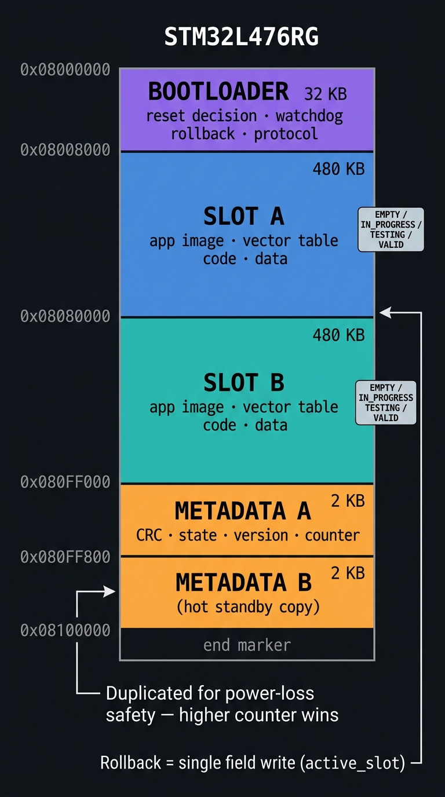

# STM32 Dual-Slot OTA Bootloader

A bare-metal firmware update system for the **STM32L476RG**, written from
scratch — no HAL, no CubeMX, no RTOS.

The board receives a new firmware image and verifies it at three independent
levels, installs it in a spare flash slot, and boots it on trial. If the
application never confirms that it started correctly, the watchdog resets the
board and the bootloader rolls back to the previous image — with no host
involvement, no button press, and no physical access.

```
========================================
  BOOTLOADER v0.2.0
========================================
Reset caused by the watchdog
Active slot : B   State : TESTING   Boot fails : 3
Failure threshold reached, rolling back → slot A
```

---


---

## Features

- **Three update paths**: SWD (ST-Link), UART trigger, or **Wi-Fi via ESP32 gateway**
- **OTA firmware update** over UART using a custom binary protocol
- **Three-layer verification**: per-frame CRC32, read-back after write, whole-image CRC from flash
- **Dual application slots** — a failed update never bricks the device
- **Automatic rollback** via independent watchdog if the new image doesn't self-confirm
- **Remote trigger** — no reset button, no physical access needed
- **Power-loss safe** at every step: invalidation marker written before any destructive operation
- **Duplicated, CRC-protected metadata** in flash — state survives erase failures

---

## Hardware

| Item | Notes |
|---|---|
| NUCLEO-L476RG | Cortex-M4F · 1 MB flash (2 × 512 KB banks) · 128 KB RAM |
| Mini-USB cable | Powers the board, carries SWD and the virtual COM port |
| ESP32-S3 *(optional)* | Wi-Fi gateway — wireless OTA with no debugger or USB cable |

**ESP32 wiring** (only needed for Wi-Fi mode):

```
STM32 PA9  (USART1 TX, CN10 pin 21)  →  ESP32 IO18
STM32 PA10 (USART1 RX, CN10 pin 33)  ←  ESP32 IO17
STM32 GND  (CN10 pin 9)             ↔  ESP32 GND
```

Each board has its own USB power supply. The shared GND is mandatory — without
it the UART link works intermittently, which is harder to diagnose than not
working at all.

---

## Memory layout

```
0x08000000  ┌──────────────────┐
            │    BOOTLOADER    │   32 KB   (≈11 KB used)
0x08008000  ├──────────────────┤
            │      SLOT A      │  480 KB
0x08080000  ├──────────────────┤
            │      SLOT B      │  480 KB
0x080FF000  ├──────────────────┤
            │   METADATA A     │    2 KB
0x080FF800  ├──────────────────┤
            │   METADATA B     │    2 KB
0x08100000  └──────────────────┘
```



Each slot is independent: it has its own size, CRC32, version, and state
(`EMPTY` / `IN_PROGRESS` / `TESTING` / `VALID`). Rollback is a single field
write — `active_slot` — with no metadata recomputation.

---

## Quick start

### 1 — Install dependencies

```bash
sudo apt install gcc-arm-none-eabi gdb-multiarch openocd
pip install pyserial --break-system-packages
```

### 2 — Build and flash the bootloader

The bootloader can only be installed over SWD (once, at provisioning time).

```bash
cd bootloader
make
make flash
```

> **Debug build** — freezes the watchdog while halted at a breakpoint:
> ```bash
> make DEBUG=1 && make flash
> ```
> Never ship a `DEBUG=1` image.

### 3 — Build the application

The application is compiled **twice**, once per slot, because each binary is
linked to a fixed address (`0x08008000` for slot A, `0x08080000` for slot B).

```bash
cd app
make            # → app_slotA.bin  app_slotB.bin
make verify     # confirms each binary is linked to the right address
```

### 4 — Bootstrap slot A over SWD (first time only)

```bash
cd app
make flashA
```

### 5 — Update firmware (choose your trigger mode)

From this point forward, no SWD access is needed.

---

## OTA trigger modes

The bootloader normally listens for **2 seconds** after reset. Triggering an
update writes `0xDEADBEEF` to the last word of RAM before the reset — SRAM is
not cleared by a system reset, so the bootloader finds it on the next boot and
extends the listen window to **30 seconds**.

### Mode 1 — SWD (ST-Link connected)

```bash
python3 tools/ota_flash.py
```

Uses OpenOCD to write the magic word and issue a software reset. Reads the
`_boot_request` symbol from all three ELF files first to verify they agree on
the address.

### Mode 2 — UART only (USB cable, no debugger)

```bash
python3 tools/ota_flash.py --via-uart
```

Holds the trigger byte `'U'` on the serial line. The application requires
**4 consecutive polls** to see it exclusively before setting the flag and
resetting. A stray byte resets the streak, so an idle terminal cannot trigger
it accidentally.

### Mode 3 — Wi-Fi (ESP32 gateway, fully wireless)

Flash the ESP32 sketch once:
```
gateway/esp32_ota/esp32_ota.ino  →  Arduino IDE → ESP32-S3
```

Then, from any machine connected to the `STM32-OTA` Wi-Fi network
(password: `bootloader`):

```bash
python3 tools/ota_flash.py --via-wifi
# custom IP:
python3 tools/ota_flash.py --via-wifi 10.0.0.1
```

**What happens automatically:**

| Step | Who | What |
|---|---|---|
| 1 | Python → ESP32 `GET /prepare` | ESP32 sends `'U'` for 3 s, waits for STM32 reboot, sends `GET_INFO` |
| 2 | ESP32 → Python | Returns free slot (`A` or `B`) |
| 3 | Python | Selects `app_slotA.bin` or `app_slotB.bin` automatically |
| 4 | Python → ESP32 `POST /upload` | Binary lands in ESP32 RAM |
| 5 | Python → ESP32 `GET /flash` | ESP32 runs the full protocol transfer locally |
| 6 | Python polls `GET /log` | Progress streamed to terminal until completion |

No file selection. No button press. No USB cable near the STM32.

**Expected output:**
```
Wi-Fi OTA  (gateway 192.168.4.1)
  calling /prepare  (OTA reset + GET_INFO)...
  OK    free slot is B
  OK    selected app_slotB.bin  (6300 bytes)

Uploading firmware to ESP32 RAM
  OK    6300 bytes ready

Firmware transfer
  board > triggering OTA reset...
  board > board: proto v1  active slot A  free slot B  state 3
  board > transfer accepted, target slot B
  board > global CRC verified, image marked TESTING
  board > --- transfer succeeded ---
  OK    done
```

---

## Host tools

All tools live in `tools/`. Dependencies: `pyserial` only (Wi-Fi mode uses
Python stdlib `http.client` + `urllib`).

| Command | What it does |
|---|---|
| `python3 tools/ota_flash.py` | End-to-end update via SWD trigger |
| `python3 tools/ota_flash.py --via-uart` | Same, UART trigger |
| `python3 tools/ota_flash.py --via-wifi` | Same, Wi-Fi gateway |
| `python3 tools/flash.py --port /dev/ttyACM0 --info` | Query board state without updating |
| `python3 -m serial.tools.miniterm /dev/ttyACM0 115200` | Read raw UART output (`Ctrl+]` to exit) |

---

## Testing

### Host-side suites

```bash
cd tools
python3 test_protocol.py     # protocol state machine
python3 bootloader_sim.py    # full transfer against the simulator
python3 debug_gui.py         # step-through visualiser with fault injection
```

| Suite | Tests | Covers |
|---|---|---|
| Protocol state machine | 47 | framing, resync, retransmission, timeouts, all error codes |
| Metadata manager | 32 | dual-page selection, power loss during erase and write, counter ties |
| Ring buffer | 22 | FIFO order, wraparound, saturation accounting |
| Rollback scenario | 15 | two-image lifecycle across rollback and reinstall |

### On-silicon results

| Module | Tests | Result |
|---|---|---|
| CRC32 | 3 | vectors matching the Python implementation exactly |
| Flash driver | 10 | all five rejection paths covered |
| Metadata manager | 25 | persistence verified across bootloader reflash |
| UART | sustained burst | 115200 baud · zero bytes lost · buffer reaching 511/511 |
| IWDG | timeout + freeze | measured timeout · debug freeze verified · reset cause reported |

### Robustness scenarios (on hardware)

**Autonomous rollback.** Application built to hang after two cycles. Watchdog
reset the board three times, failure counter advanced on each, bootloader
switched to the previous slot — no human intervention, ~20 seconds total.

```
*** DELIBERATE HANG — watchdog reset expected in ~3 s ***

BOOTLOADER v0.2.0  —  Reset caused by the watchdog
State : TESTING   Boot fails : 3
Failure threshold reached, rolling back → slot A
```

**Power loss mid-transfer.** Cable pulled at 51 %. Active slot stayed `VALID`;
target slot left `IN_PROGRESS` and correctly skipped.

**Wrong binary.** Slot-B image while slot A is free — rejected before a single
byte is transmitted, by the host tool and again by `ERR_SLOT`.

**Corrupted frame.** Single flipped bit fails the CRC; bootloader NACKs, host
retransmits. Idempotent.

**Wi-Fi OTA.** Full wireless update verified end-to-end: trigger → transfer →
self-confirmation → next update directed to the alternating slot.

---

## Design notes

### Two slots

A single-slot bootloader must erase the running firmware before writing the
new one. Any interruption leaves the device unbootable. Two slots remove the
window: the incoming image goes into the inactive slot; the running one is
never touched until the new image proves itself.

### Two binaries per firmware version

A compiled binary is bound to its link address. The two slots are 480 KB apart,
so the build produces two binaries from the same source. The host picks the
right one after querying the board — or in Wi-Fi mode, does so automatically.

```
slot A:  0080 0120  2186 0008  …   (reset handler at 0x08008621)
slot B:  0080 0120  2106 0808  …   (reset handler at 0x08080621)
         └────────┘ └────────┘
         stack ptr  addresses shifted by 0x78000 (480 KB)
```

### `TESTING` state

A correct CRC proves *integrity*, not *correctness*. A freshly installed image
is marked `TESTING`. The bootloader increments the failure counter **before**
the jump. The application must write `VALID` after running successfully. If it
never does, the counter reaches threshold and the bootloader falls back.

### Watchdog starts in the bootloader

The IWDG is started on the **first line of `main()`** in the bootloader — so a
crash in `startup.s` or a HardFault on the first instruction is also caught.
The bootloader refreshes it during update mode; the application refreshes it
conditionally, only when its work unit actually advanced.

### Wi-Fi gateway design

The ESP32 receives the binary over HTTP, buffers it in RAM, then transfers it
to the STM32 over UART using the exact same binary protocol. The two networks
are fully decoupled — a dropped Wi-Fi connection during upload costs nothing
because the STM32 transfer has not started. Once it does, it runs locally at a
fixed rate with no network in the loop.

The gateway exposes three endpoints:
- `GET /prepare` — trigger + GET_INFO → returns free slot
- `POST /upload` — receive binary into RAM
- `GET /flash` — run transfer; `GET /log` — stream progress

### Interrupt-driven UART + ring buffer

At 115200 baud a byte arrives every 87 µs. A page erase takes ~20 ms — enough
to lose 200+ bytes if the CPU were polling. Reception uses a lock-free
single-producer / single-consumer ring buffer. No critical section needed.

### Duplicated metadata pages

The metadata must survive power loss. Only the inactive page is ever erased;
between two valid copies the higher counter wins. Each copy carries a CRC —
a valid magic alone is insufficient because it shares its 8-byte write unit
with the counter.

---

## Repository layout

```
├── bootloader/
│   ├── main.c          boot decision, state machine, rollback, jump
│   ├── startup.s       vector table, .data/.bss init
│   ├── linker.ld       32 KB at 0x08000000
│   └── src/
│       ├── protocol_mgr.c   frame assembly and command dispatch
│       ├── uart.c           interrupt-driven RX, ring buffer
│       └── systick.c        millisecond time base
│
├── app/
│   ├── main.c          demo application with self-confirmation and OTA trigger
│   ├── startup.s       same vector table, different link address
│   ├── linker_slotA.ld 0x08008000
│   └── linker_slotB.ld 0x08080000
│
├── drivers/            shared hardware drivers, compiled into both images
│   ├── crc.c           hardware CRC32 peripheral
│   ├── flash.c         erase, write with read-back, bootloader-region guard
│   ├── metadata_mgr.c  dual-page persistent state manager
│   ├── iwdg.c          independent watchdog
│   └── fault.c         HardFault/MemManage/BusFault handler (reports over UART)
│
├── shared/             headers included by both images and the drivers
│
├── gateway/
│   └── esp32_ota/
│       └── esp32_ota.ino   Wi-Fi gateway (headless REST API, no web UI)
│
├── tools/
│   ├── ota_flash.py    end-to-end update tool (SWD / UART / Wi-Fi)
│   ├── flash.py        transfer and board query tool
│   ├── transport.py    serial transport layer
│   ├── protocol.py     frame encode / decode
│   ├── crc32.py        CRC32 matching the STM32 peripheral output
│   ├── bootloader_sim.py   executable specification / simulator
│   ├── test_protocol.py    host-side test suite
│   └── debug_gui.py    protocol step-through visualiser with fault injection
│
└── PROTOCOL.md         full binary protocol specification
```

---

## Limitations

**Integrity, not authenticity.** CRC32 detects accidental corruption; it offers
no protection against a deliberately crafted image. Hardening requires ECDSA
signature verification against a write-protected public key.

**Fixed update window.** The bootloader listens for 2 seconds after reset. The
boot-request mechanism extends this to 30 seconds via any trigger mode.

**Dual binaries.** The host holds two images per firmware version. Hardware
with true bank remapping could use one.

**The bootloader cannot update itself.** Fixing a bug requires SWD access or
the ST ROM bootloader via BOOT0.

---

## Planned work

- FreeRTOS application layer with a supervisor task driving conditional watchdog refresh
- CAN as a second transport (the protocol layer is already transport-agnostic)
- ECDSA firmware signature verification

---

## References

- **RM0351** — STM32L4x5/L4x6 reference manual (flash, CRC, USART, IWDG, boot)
- **UM1724** — STM32 Nucleo-64 boards user manual (pinout, ST-LINK, solder bridges)
- **DS10198** — STM32L476xx datasheet (alternate function mapping, LSI accuracy)
- **MCUboot** — reference implementation studied for comparison

---

## License

MIT
